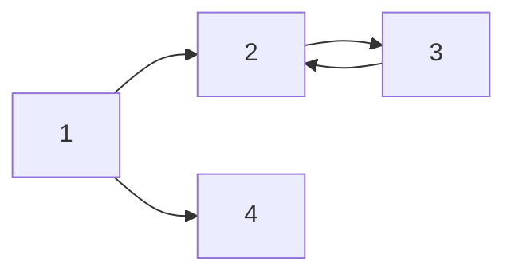

# 마크다운

# H1 태그
## H2 태그
### H3 태그
#### H4 태그

---

*기울임*
**굵게**
***기울임+굵은체***
~~줄그어짐~~
>이것은 Quote입니다. 문구 적을 때 사용

---
|제목|내용|비고|
|-|-|-|
|깃헙|마크다운|표만들기|

---

링크와 이미지

[링크이름](http://www.naver.com)
[chowonjae의 블로그](https://velog.io/@hardworking)


---

`간단한 코드 `

```java
int num = 6;
int num2 = 3;
int sum = num + num2;
System.out.println(sum); // 9
```

---

택문법(수식편집)
^ 제곱 
_1 항
ㅇ
$a^2 + b^2 = c^2$ 텍스트와 섞어 사용 가능
$$a^2 + b^2 = c^2$$ 텍스트 섞어서 불가능

tex으로 검색하여 원하는 것 가져다가 사용하기

---
다이어그램 그려주는 틀

